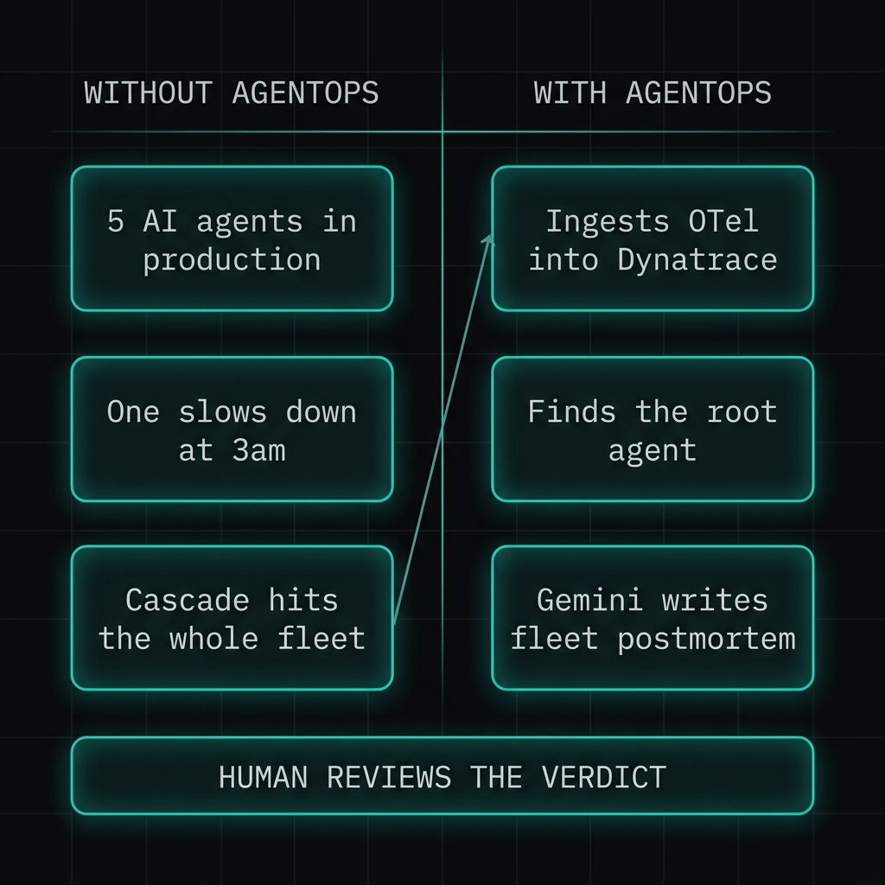
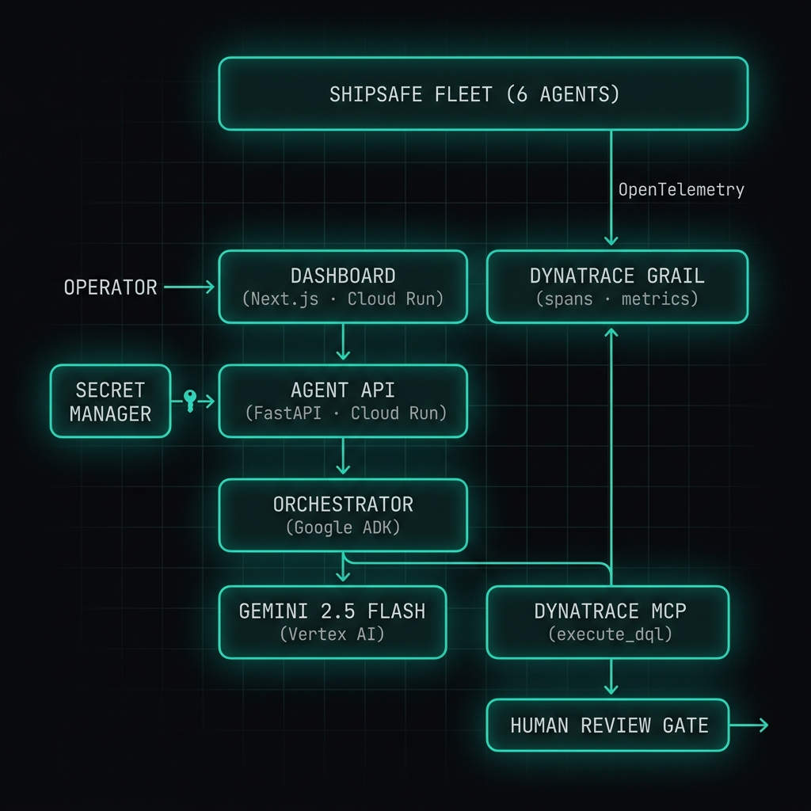
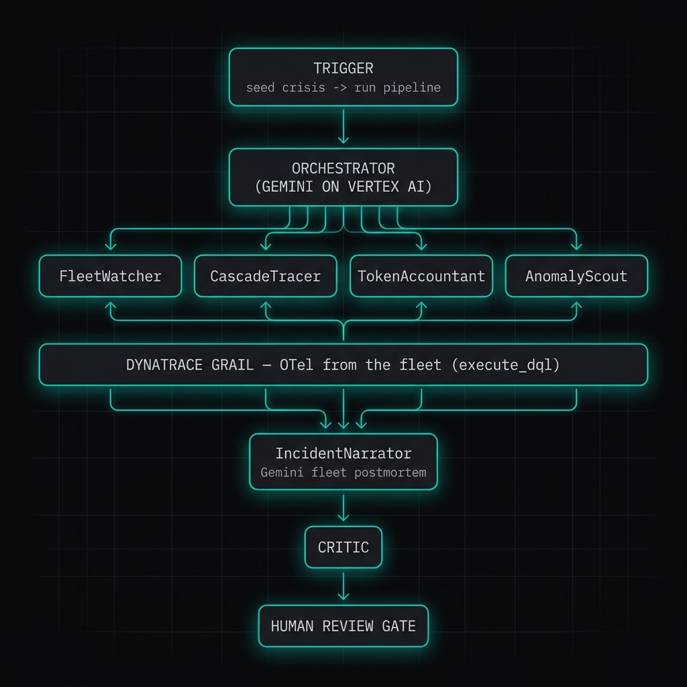
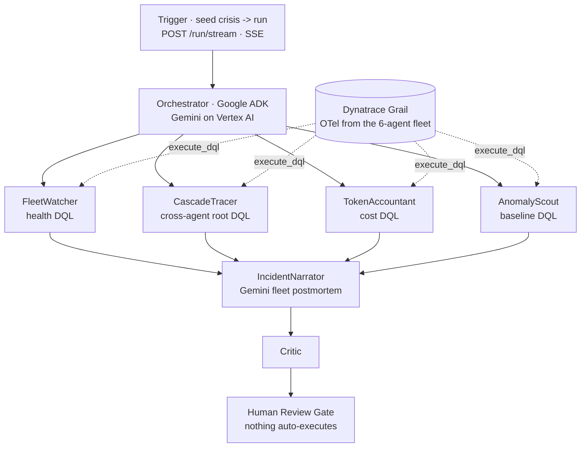
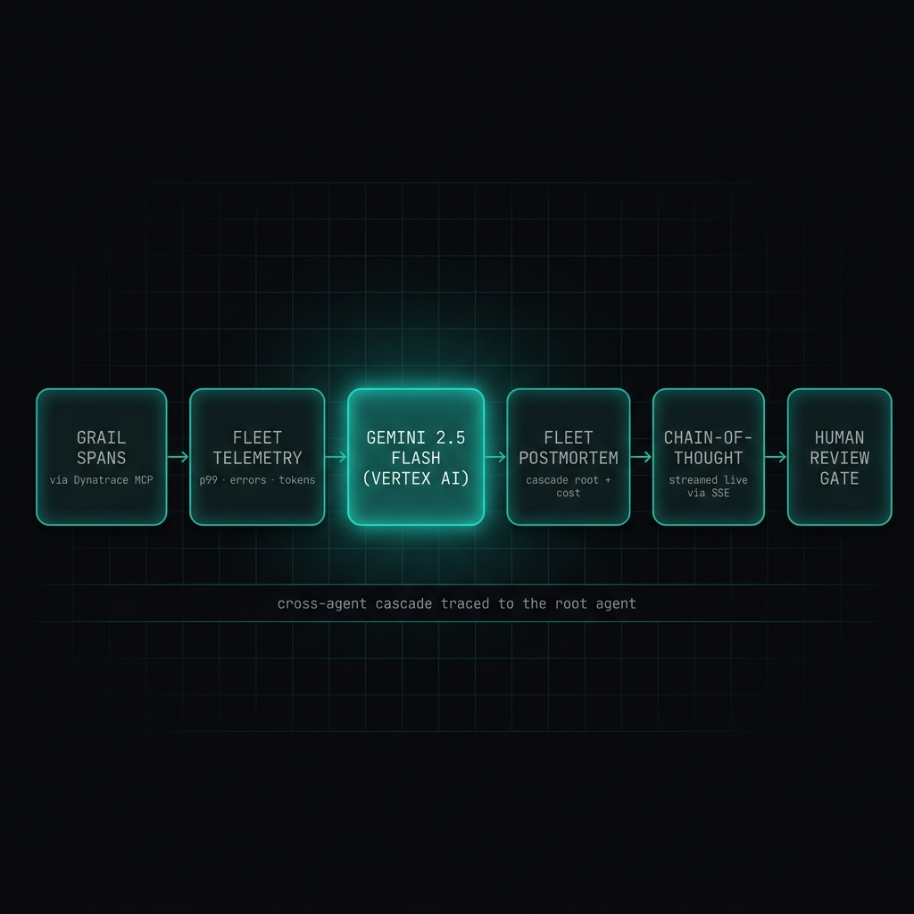

<!--
  AgentOps — Devpost "Project details" / "About the project"
  Paste the body below into Devpost. Upload the 4 PNGs in this folder to Project Media.
  Devpost does NOT render Mermaid — for the Devpost paste, drop the ```mermaid block
  (the uploaded PNGs cover it). On GitHub, both the PNGs and the Mermaid render.
-->

> **AgentOps is demonstrated on the ShipSafe fleet, but it works for ANY AI agents on Cloud Run that emit OpenTelemetry** — a recommender service, a pricing agent, a customer-support bot.

## Inspiration

You deploy AI agents to protect production — and then the agents become the new black box. They make hundreds of autonomous decisions a day: calling tools, burning tokens, and quietly cascading failures into one another. When one slows down at 3am, its latency ripples into the agent that depends on it, and the one that depends on *that*. You're staring at five healthy-looking dashboards and still can't answer the only question that matters: **which agent started it?**

Observability for distributed systems has always existed — but pointing it *at your agents*, and reasoning over the result, is the missing capstone. So we built the agent that watches the watchers.



## What it does

AgentOps ingests the fleet's **OpenTelemetry** traces into **Dynatrace Grail** and runs a six-stage pipeline that turns raw spans into an operator-ready verdict:

1. **FleetWatcher** — one DQL query → per-agent health (error rate, p50/p99 latency, a fleet health score).
2. **CascadeTracer** — groups error spans by `trace.id`, finds traces with errors in more than one service, and **names the root agent** of the cross-agent cascade.
3. **TokenAccountant** — DQL → real Gemini token spend and cost, per agent and model.
4. **AnomalyScout** — DQL → latency/error anomalies vs a rolling baseline window.
5. **IncidentNarrator** — **Gemini** synthesises stages 1–4 into a fleet postmortem (title, severity, timeline, recommendations) with visible chain-of-thought.
6. **Critic** — prompt-injection defense + the human approval gate; always last, fails closed.

The query that does the magic — naming the root agent of a fleet-wide failure:

```dql
fetch spans, from:now()-30m
| filter span.status_code == "error"
| filter in(service.name, "cargodb", "voyageblack", "tidesync", ...)
| summarize errorServices=collectDistinct(service.name), spanCount=count(), by: {trace.id}
| filter arraySize(errorServices) > 1
```

The dashboard renders a **live activity feed**: each of the six agents flips ●→✓ with a real one-line result as its stage completes.

## How we built it

Six agents on **Google ADK**, running on **Cloud Run**. Every read goes through the official **Dynatrace MCP server** (`execute_dql` against Grail); every reasoning step is **Gemini 2.5 Flash on Vertex AI**.

**System architecture — AgentOps watching the fleet:**



**The six-stage pipeline:**





**Gemini is the brain** — Grail spans become a typed fleet postmortem with the cascade root and cost, streamed live:



Two Dynatrace channels keep it honest: an **OTel push** (the fleet emits traces) and a **DQL pull** (AgentOps queries Grail via the MCP). AgentOps only **reads** — it makes no HTTP calls to the other agents, so each submission runs independently.

**Stack:** Python · Google ADK · Gemini 2.5 Flash (Vertex AI) · Dynatrace Grail + DQL + Dynatrace MCP · OpenTelemetry · FastAPI · Server-Sent Events · Next.js + Tailwind · Cloud Run · Secret Manager · Docker.

## Challenges we ran into

- **A live feed that fought us.** The activity stream runs the pipeline inside an async generator, and ADK's `MCPToolset` binds anyio cancel scopes to the task it runs in — running it directly in the generator threw "exit cancel scope in a different task." We moved the pipeline into its own task and bridged events to the SSE stream through a queue, so every MCP session opens and closes in one task.
- **Vertex AI 429s.** Six Gemini calls back-to-back under shared quota hit `RESOURCE_EXHAUSTED`. For the live feed we run the stages **sequentially** (one Gemini call at a time) and added 429 retry with backoff — reliable beats fast for a demo.
- **OpenTelemetry's silent failures.** The protocol must be `http/protobuf`, the OTLP base is `{env}/api/v2/otlp` (the SDK appends `/v1/traces`), the ingest token needs `openTelemetryTrace.ingest`, the DQL token needs the Grail read scopes, and the MCP server needs the `apps.dynatrace.com` host, not `live.dynatrace.com`. Every one of these fails *silently*.
- **Cross-agent cascade detection.** Finding the *root* of a fleet-wide failure isn't "is this service slow" — it's "which distributed trace had errors in more than one agent, and who's at the head of it." That's one carefully-built DQL, and it's the heart of the product.

## Accomplishments that we're proud of

- **The capstone that watches the other five agents** — cross-agent root-cause from a single DQL.
- A **live activity feed** that streams each agent's real result as it lands.
- **Real Gemini token accounting** and captured chain-of-thought, not mocked numbers.
- Six agents, one fleet, **one screen** — with a human gate on every verdict.

## What we learned

- You can only find a cascade's root with **distributed tracing across agents** — per-service health hides it.
- Under a shared LLM quota, **sequential-and-resilient beats concurrent-and-flaky** for anything you'll demo live.
- ADK `MCPToolset` + async generators is an anyio cancel-scope minefield; isolate the work in its own task.
- **You can't operate a fleet you can't see.** Observability isn't an add-on for an agent platform — it's the capstone.

## What's next for AgentOps

- Ingest from **live** agents instead of seeded telemetry, with alerting on cascade detection.
- Auto-drafted remediation proposals (still human-gated).
- Anomaly forecasting — flag the cascade *before* it propagates.
- Point-and-observe onboarding for any OpenTelemetry-emitting fleet on Cloud Run.

---

**Built with** (Devpost tag field): `python · google-adk · gemini · vertex-ai · dynatrace · grail · dql · model-context-protocol · opentelemetry · fastapi · server-sent-events · next.js · tailwindcss · google-cloud-run · secret-manager · docker`

**Try it out:**
- Live dashboard — https://shipsafe-agentops-dashboard-336382452417.us-central1.run.app
- GitHub — https://github.com/shipsafe-ai/shipsafe-agentops
- One command — `npx shipsafe-agentops demo`
